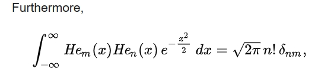

ACE 相关资料汇总

* 两个随机变量间的最大相关：[徐祥祥师兄的组会报告](./Seminar_ace.pdf) 里讲得比较清楚
* 两个随机变量间按最大相关度提取前k个特征：[李嘉麟师兄的AAAI论文](https://arxiv.org/pdf/1811.08979.pdf) 里有介绍，
文章题目是“An Efficient Approach to Informative Feature Extraction from Multimodal Data”
* Multivarite ACE，[这篇期刊文章]介绍的比较详细(http://lizhongzheng.mit.edu/sites/default/files/documents/mace_final.pdf)。
注，这篇介绍 Multivarite ACE 的文章（An information-theoretic approach to unsupervised feature selection for high-dimensional data）在2017年ITW上
以会议论文的形式发表过，2020年扩充后发到了期刊上，二作由张林老师变成了徐祥祥师兄，
反映了张老师逐渐淡出学术圈这一事实。

joint 高斯分布的 HGR 等于 相关系数，这个结论在下面[这篇论文](./2333274.pdf) 里证明了，证明思路是是用 Hermite polynomial 作为基函数对f,g进行级数展开。但证明里有两个小错误。
这里指出并加以改正。

Lancaster, H.O. (1957) Some properties of the bivariate normal distribution considered in the form of a contingency table. Biometrika, 44, 289±292.

上图中，第一行第二项多打了一个x，修正后的表达式期望值应是 exp(tu*rho)，对 tu 做泰勒展开并利用下式进行比较系数即得(9)式。

