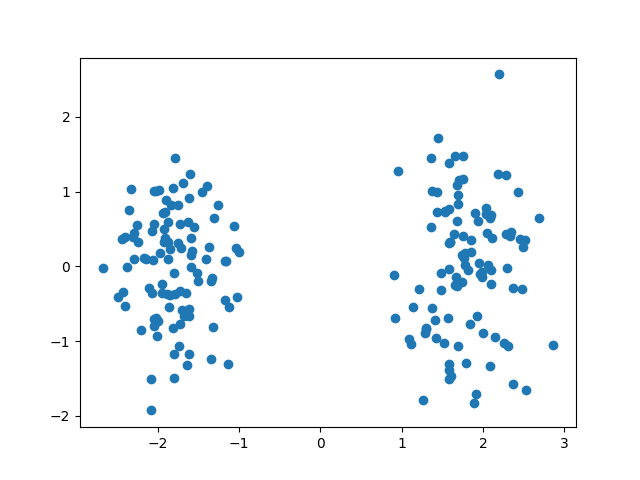

### Graph (network) embedding and community detection

A recommended survey article:

[1] Hamilton, William L., Rex Ying, and Jure Leskovec. "Representation learning on graphs: Methods and applications." *arXiv preprint arXiv:1709.05584* (2017).

We consider a graph embedding function $f(G)$ and graph label $Y$.

By using data clustering techniques (for example k-means clustering) we can get an estimator $\hat{Y}$ from $f(G)$.

Spectral clustering is such a two-stage method.

Our goal is to find the embedding function which can make the exact recovery possible.

$f: G \to X_{n \times k}$

Assumption: the edges are more densely connected within the community and

are loosely connected between different communities.

$Y$ is one node label (independent Bernoulli random variable).

$X_{ij}$ be the edge connection information, random variable depending only on node $i, j$. We can regard

$X$ as an adjacency matrix.

Suppose $f$ be a function which maps $n(n-1)/2$ vector to a $k$ vector and $g$ is a function

which maps the node label (of the set $\mathcal{Y}$) to its higher ($k$) dimension embedding. We can also

treat $f$ as a mapping from $\mathcal{X}\to \mathbb{R}^k$ where $|\mathcal{X}| = 2^{\binom{n}{2}}.$

Suppose there are $r$ communities,

then we should choose $k=r-1$. For example, we consider $r=2$ first below. Our goal is to maximize the averaged correlation. The optimization problem should have some normalization constraint. We require that $E[f(X)]=0$ and $\textrm{Var}[f(X)] = 1$.  Without specific emphasis, all expectation is take conditioned

on $Y_2=1$ to avoid the trivial symmetric case.
$$
\max E[ g(Y_1) \cdot f(X)]
$$

By Cauchy's inequality we know the maximal value is 1.

Since $Y_1$ only takes two values $\pm 1$, and $Y_1$ is independent with $Y_2$, $\mathbb{E}[g(Y_1)]=0, \mathrm{Var}[g(Y_1)]=1$.

we must have $g(1)=1,g(-1)=-1$. That is, $g$ is an identity mapping.

Then our goal is to maximize $\sum_{x\in \mathcal{X}} f(x)[P(X=x,Y_1=1)-P(X=x,Y_1=-1)]$.

Under the two constraints:
$$
\begin{align}
\sum_{x\in\mathcal{X}} f(x)P(X=x) &= 0 \\
\sum_{x\in\mathcal{X}} f^2(x) P(X=x) &= 1
\end{align}
$$
From the first constraint, we have

$\sum_{x\in\mathcal{X}} f(x)(P(X=x,Y_1=1)+P(X=x,Y_1=-1)) = 0$, therefore, the object

function is transformed to $2\max\sum_{x\in \mathcal{X}} f(x)P(X=x,Y_1=1)$.

We can use Lagrange multiplier to solve $f(x)$:

$\max \sum_{x\in \mathcal{X}} [P(X=x,Y_1=1)f(x) - \lambda_1 f(x) P(X=x)-\lambda_2 P(X=x) f^2(x)]$

Then
$$
f(x) = \frac{P(X=x,Y_1=1)-\lambda_1P(X=x)}{2\lambda_2P(X=x)}
$$
Using the two constraint equalities we can get $\lambda_1, \lambda_2$ as
$$
\begin{align}
\lambda_1 &= \sum_{x\in \mathcal{X}}P(X=x,Y_1=1) = P(Y_1=1)=0.5\\
4\lambda_2^2 &= \sum_{x\in \mathcal{X}} \frac{(P(X=x,Y_1=1)-\lambda_1 P(X=x))^2}{P(X=x)}
\end{align}
$$
Notice that $\lambda_2$ is only a normalization constant, if we want to use the sign

of $f(x)$ to judge its community belonging, we only need to compare

$P(Y_1=1|X=x,Y_2=1)$ with $\lambda_1=0.5$.

We can rewrite $f(x)$ as 
$$
f(x) = \frac{1}{C}\frac{P(X=x | Y_1=1,Y_2=1)-P(X=x|Y_1=-1,Y_2=1)}{ P(X=x | Y_1=1,Y_2=1)+P(X=x|Y_1=-1,Y_2=1)}
$$

If we only care about the sign of $f(x)$, then it is enough to consider the magnitude

of $P(X=x | Y_1=1,Y_2=1)$ and $P(X=x | Y_1=-1,Y_2=1)$.

Notice that:
$$
\begin{align}
P(X=x| Y_1=1, Y_2=1) &= \sum_{y_3,\dots, y_n = \pm 1}
P(X=x|Y_1=1, Y_2=1, Y_3=y_3, \dots, Y_n=y_n)\cdot P(Y_3=y_3, \dots, Y_n=y_n) \\
&=\sum_{y_3,\dots, y_n = \pm 1}\frac{1}{2^{n-2}}P(X=x|Y_1=1, Y_2=1, Y_3=y_3, \dots, Y_n=y_n) \\
\end{align}
$$
in which $y_3, \dots, y_n$ are i.i.d. Bernoulli(1/2).

Suppose the adjacency matrix is $A$, which is a function of $x$. The matrix $A' = J-I-A$ where $J$ is the matrix with all-one element,

we define $h_x(y)=(p/q)^{y^TAy/4}(\frac{1-p}{1-q})^{y^TA'y/4}$.

Then we can write
$$
P(X=x|Y_1=1, Y_2=1, Y_3=y_3, \dots, Y_n=y_n) = (\frac{pq}{(1-p)(1-q)})^{|E|/2}h_x(y)
$$
Let $N=2^{n-2}, \bar{y}=(y_3,\dots,y_n)$, the space for $\bar{y}$ is denoted as $S$,  we can write  $f(x)$ as:
$$
f(x) = \frac{1}{C}\frac{\sum_{\bar{y} \in S}(h_x(1,1,\bar{y}) - h_x(-1,1,\bar{y}))}{\sum_{\bar{y} \in S}(h_x(1,1,\bar{y}) + h_x(-1,1,\bar{y}))}
$$
High dimensional case: svd decomposition.

## Relation with spectral clustering within the setting of SBM

$$
P(X=x|Y_1=1,Y_2=1) - P(X=x|Y_1=-1,Y_2=1)=\frac{1}{2^{n-2}}(\frac{pq}{(1-p)(1-q)})^{|E|/2}(\frac{1-p}{1-q})^{-n/4}\sum_{i=1}^{2^{n-2}} (\exp(h_1(1,1,y_3,\dots, y_n)) - \exp(h_1(-1,1,y_3,\dots, y_n)))
$$

The function $h(y)$ for $y \in \{\pm 1\}^n$ has the following form:
$$
h(y) = \frac{||y||_2^2}{4}\log\frac{1-p}{1-q} + \frac{y^TAy}{4}\log\frac{p(1-q)}{q(1-p)}
$$
Conjecture: Suppose $p,q$ are constant, $\hat{y} = \arg\max_{y \in \{\pm 1\}^n} y^T A y$ such that $\hat{y}_2=1.

Then $\sum_{y_3, \dots, y_n} (h_1(\hat{y}_1,1,y_3, \dots) - h_1(-\hat{y}_1,1,y_3, \dots)) > 0$.

If the following conjecture holds, $P(X=x|Y_1=\hat{y}_1,Y_2=1) > P(X=x|Y_1=-\hat{y}_1,Y_2=1)$, then we should choose $\hat{y}_1$ as the estimated label for $Y_1$. This established the connection of spectral clustering

with SBM in a very simple case.

## Simple example for $n=4$

Two parameters: $p,q$.

$|\mathcal{X}|=64$. The length of vector $X$ is 6.

Simulation: $p=0.7, q=0.3$, the optimal value is 0.44.

Now we consider $r>2$, then we should fix $Y_2 = v_2, Y_{r} = v_r$ where $v_1, v_2, \dots v_r \in \mathbb{R}^{r-1}$.

$||v_i||=1, \sum_{i=1}^r = v_i = 0, v_i \cdot v_j = \frac{-1}{r-1}$.

We are solving:
$$
\max E[ \sum_{i=2}^ r g_i(Y_1) \cdot f_i(X) | Y_2 = v_2, \dots, Y_r = v_r]
$$

### Useful property of HGR maximal correlation

If the HGR maximal correlation $\rho(X;Y)=0$, then $X$ and $Y$ are independent.

Proof:

For any $f,g$ we have $\mathbb{E}[f(x)g(y)] = \mathbb{E}[f(x)]\mathbb{E}[g(y)]$.

Choosing $f(x)=\mathbf{1}[X=x]$ and $g(y) = \mathbf{1}[Y=y]$,  we have

$P(X=x, Y=y) = P(X=x)P(Y=y)$.

That is, $X$ and $Y$ are independent.

Understanding HGR maximal correlation:

Suppose $Y, X$ are correlated binary distributions, specified by

$P(Y=1, X=1)=p, P(Y=0, X=1)=q, P(Y=1, X=0)= r - p, P(Y=0, X=0)=1-r-q$.

Then the B matrix of $X,Y$ can be written as:
$$
B=\begin{pmatrix}
\frac{1-r-q}{\sqrt{1-r}\sqrt{1-p-q}} & \frac{q}{\sqrt{1-r}\sqrt{p+q}} \\
\frac{r-p}{\sqrt{r}\sqrt{1-p-q}} & \frac{p}{\sqrt{r}\sqrt{p+q}}
\end{pmatrix}
$$
We can write the SVD decomposition of $B$ analytically:

$B=U\Sigma V^T$ where $\Sigma = \textrm{diag}(1, \sigma_2)$
$$
\sigma_2=\frac{|p-pr-qr|}{\sqrt{r(1-r)}\sqrt{p+q}\sqrt{1-p-q}}, U = \begin{pmatrix}
\sqrt{1-r} & \sqrt{r}\\
\sqrt{r} & -\sqrt{1-r}
\end{pmatrix}, V = \begin{pmatrix}
\sqrt{1-p-q} &  s\sqrt{p+q}\\
\sqrt{p+q} & -s \sqrt{1-p-q}
\end{pmatrix}
$$
The sign indicator $s$ is defined as:
$$
s = \begin{cases}
1 & p - pr - qr > 0 \\
-1 & p - pr - qr < 0
\end{cases}
$$

When $p=pr+qr$, $\sigma_2=0$ which means that $X$ and $Y$ are indepedent.

For this special example, the HGR maximal correlation $\sigma_2$ equals the Pearson correlation coefficient.

Binary Symmetric model is the special case of the above 2x2 B matrix. (See for example, https://github.com/zhaofeng-shu33/ace_cream/blob/master/example/BSC.py)

## Neural Network Approach

We can treat the $X$ as n data points. We are dealing with an unsupervised machine learning problems.

We use auto-encoder framework to obtain low-dimensional embedding for each node of the graph.

 Since SBM model is very simple, for the encoder and decoder, we only use one fully connected layer

to represent it. The intermediate layer is regarded as the embedding of the graph.

For $k$ community, we require that the intermediate layer has $k-1$ units. Suppose $X_i$ is the input and

$\widehat{X}_i$ is the output (reconstruction of the graph for the $i$-th node), we wish $\widehat{X}_i$is as close to $X_i$ as possible.
$$
\widehat{X}_i = g(f(X_i))
$$
where $f$ maps $X_i$ from $\mathbb{R}^n$ to $\mathbb{R}^{k-1}$ with the form $f(X_i)= \sigma(W_1 X_i + b_1)$.

Let $Z_i=f(X_i)$ represents the embedding of $X_i$ (a certain node),

then $g$ maps $Z_i$ from $\mathbb{R}^{k-1}$ to $\mathbb{R}^{n}$ with the form $g(Z_i)= \sigma(W_2 Z_i + b_2)$.

$X=(X_1, \dots, X_n)$ be an $n\times n$ matrix. The same is true for $\widehat{X}$.

The loss function is defined as
$$
L = ||(X-\widehat{X}) \odot B ||_F^2
$$
where $\odot$ means the Hadamard product. The matrix $B$ is the weight matrix, which assigns higher weight

for positive samples (edge observations). The reason to use $B$ is that the graph is sparse as $n$ becomes large. With uniform weight, $\widehat{X}$ tends to be zero matrix, which can not capture the property of the graph.

The idea to use weighted loss comes from the model SDNE (2016, Structural Deep Network Embedding).

In that paper, $X$ is the adjacency matrix, and $B$ is chosen to have weight $\beta > 1$ for positive samples and weight

1 for other positions. The definition of $B$ is
$$
B = (\beta - 1) X + \mathbf{1}_n \mathbf{1}_n^T
$$

In our experiment, we find that using $X$ directly as input to the neural network

does not work well. This can be empirically explained as the fact that the encoder only uses the first-order proximity for each node, which is not stable enough for reconstruction. In experiment, we found that

using the cosine similarity matrix as the input to the neural network works better than

that of the adjacency matrix. Though the cosine similarity matrix is a dense matrix, we also need a parameter $\beta>1$ to assign more weight for node pairs $(i,j)$ which are more similar. That is, we enlarge

the similarity effect. Suppose $v_i = A_{i\cdot}$ is the $i$-th row of the adjacency matrix.

$X_{ij} = \textrm{cosine_similarity}(v_i, v_j)$.

In the paper of SDNE, there are many other techniques to enhance the embedding.

By ablation study we found that the most important factor is the weight matrix $B$. If we do not use $B$,

the embedding is almost rubbish.

Once obtaining the embedding vectors for each node, we can use KMeans to cluster the nodes and obtain

the community belonging for each node.

#### Low-rank approximation interpretation

If $\beta=1$ and $\sigma=\textrm{iv}$ (identity mapping), then minimization problem is
$$
||W_2 W_1 X + (W_2 b_1 + b_2)\mathbf{1}_n^T - X||_F^2
$$
Let $W_1 X = W_1', b_1' = W_2 b_1 + b_2$. We can rewrite the above loss as:
$$
||W_2 W_1' X + b_1'\mathbf{1}_n^T - X||_F^2
$$
Therefore, we are trying to get a $k$ rank approximation of $X$. For $X_{ij}$ chosen from cosine similarity or adjacency matrix, $\mathbb{E}[X]$ has an eigenvector $\mathbf{1}_n$. Therefore, we are actually solving the other $k-1$ largest eigenvectors of $X$.

## Spectral Clustering Approach

To embed $Y_1$ given $Y_2=1$ in a numerical number.  We use the second smallest eigenvector of the unnormalized Laplacian function of the graph. We should make the eigenvector to have length 1

and the second component to be positive. Then we use the first component as the numerical embedding

of $Y_1$.

Theoretical analysis of spectral clustering for SBM community detection does not have beautiful result.

They use matrix perturbation theory, notably the Davis-Kahan theorem, the conclusion is that
partial recovery is possible by using the first k smallest eigenvector of Laplacian matrix. That is,
the number of misclassified nodes converges to zero. Some authors use some post processing steps after
spectral clustering to achieve exact recovery. This makes the complete algorithm quite complex. Though
it has theoretical values, it lacks practicality. For some reference,

[1] Yun, Se-Young, and Alexandre Proutiere. "Accurate community detection in the stochastic block model via spectral algorithms." *arXiv preprint arXiv:1412.7335* (2014).

 

## Comments of Professor Huang

Optimal value is computational intractable. Try to find some sub-optimal algorithm and show that in some

special model they can approximate the optimal value in asymptotic regime.

SBM is not a very useful model, especially when modeling the community in real world.

Show that spectral embedding is a special kind of embedding under the framework of encoding-decoding view.

## Laplacian Eigenmap and Spectral Clustering

Laplacian eigenmap is the same with the normalized spectral clustering

[1] Belkin, Mikhail, and Partha Niyogi. "Laplacian eigenmaps and spectral techniques for embedding and clustering." *Advances in neural information processing systems* 14 (2001): 585-591.

## Some experimental results for several embedding methods

The article [1] compares several graph embedding techniques for several tasks. Notably for link

prediction.

[1] Goyal, Palash, and Emilio Ferrara. "Graph embedding techniques, applications, and performance: A survey." *Knowledge-Based Systems* 151 (2018): 78-94.

## PCA and SBM

We apply PCA (sklearn.PCA) to a graph adjacency matrix. The graph is generated by SBM(n, k, p, q) with

$n=200, p=\frac{a \log n}{n}, q = \frac{b \log n}{n}$ while $a=14, b=4, k=2$.

As can be seen, the data is clearly separated.

Roughly speaking, PCA is doing eigen-decomposition to $A^2$, which describes the two-walk metrics between

the nodes.

New comments of Professor Huang

Try to find an unsupervised approach to perform maximum correlation.