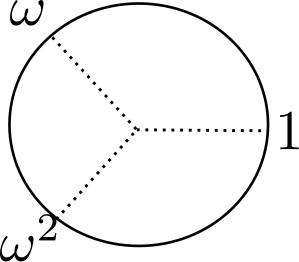

## How to draw X in two communities

$X$ is draw from uniformly whose $\binom{n/2}{n}$ position takes value $+1$;

Each component of $X$ is draw from Bernoulli distrbituion with $p=0.5$.

Abbe said they were equivalent when $n$ is large.

## A simple illustration of Abbe's conclusion

$$
p=\frac{a\log n}{n}, q=\frac{b\log n}{n}
$$

Fully recovering requires $\sqrt{a} - \sqrt{b} > \sqrt{2}$

Problems with critical value?

Min Ye:
$$
P(B_i - A_i \geq 0) \leq n^{-\frac{(\sqrt{a} - \sqrt{b})^2}{2}}
$$
MNS16 (Theorem 2.5):

​      $X \sim B(\frac{n}{2}, p_n), Y \sim B(\frac{n}{2}, q_n), \Pr(Y\geq X) = o(n^{-1}) \iff $ fully recovery

## Extension of Ising model to three communities

### critical value of $\beta$

$\sigma \in \{1,\omega,\omega^2 \}^n$, root of $x^3-1$. cyclic group: $\sigma^3=1$

Indicator function
$$
I(\sigma_i, \sigma_j) = \begin{cases} 2 & \sigma_i = \sigma_j \\
-1 & \sigma_i \neq \sigma_j\end{cases}
$$
Suppose $x_i, \dots, x_n$ are draw uniformly from $\{1,\omega,\omega^2\}^n$ (That is, there are $\frac{n}{3}$ items taking value $0$, $\frac{n}{3}$ items taking value 1...)

Thus gurantee $\sum_{i=1}^n I(x_i, \sigma) = 0$ for any $\sigma$

Ising model
$$
P_{\sigma | G}(\sigma = \bar{\sigma}) = \frac{1}{Z_G(\alpha, \beta)}\exp\left(\beta \sum_{\{i,j\}\in E(G)}I(\bar{\sigma}_i, \bar{\sigma}_j) - \frac{\alpha \log(n)}{n} \sum_{\{i,j\} \not\in E(G)} I(\bar{\sigma}_i,\bar{\sigma}_j)\right)
$$

For SBM with three communities and $p=\frac{a\log n}{n}, q=\frac{b\log n}{n}$

  $\sqrt{a} - \sqrt{b} > \sqrt{3}$ is sufficient to recover the community structure (Abbe).

Define
$$
\begin{align}
A_i &= |\{j \in [n]\backslash\{i\}: \{i,j\} \in E(G), X_j = X_i\}| \\
B_i &= |\{j \in [n]\backslash\{i\}: \{i,j\} \in E(G), X_j = \omega \cdot X_i\}| \\
C_i &= |\{j \in [n]\backslash\{i\}: \{i,j\} \in E(G), X_j = \omega^2 \cdot X_i\}|

\end{align}
$$

Computation of critical value $\beta^*$:
$$
\begin{align}
\frac{P_{\sigma |G}(\sigma_i \neq X_i)}{P_{\sigma | G}(\sigma = X)} &=
\frac{P_{\sigma |G}(\sigma_i = \omega \cdot X_i)}{P_{\sigma | G}(\sigma_i = X)}+\frac{P_{\sigma |G}(\sigma_i = \omega^2 \cdot X_i)}{P_{\sigma | G}(\sigma = X)}\\
&= \exp\left(3(\beta + \frac{\alpha \log n}{n})(B_i-A_i)-\frac{4\alpha \log n}{n}\right)\\
&+ \exp\left(3(\beta + \frac{\alpha \log n}{n})(C_i-A_i)-\frac{4\alpha \log n}{n}\right)
\end{align}
$$
Due to symmetry, when evaluation the expection, only

need to examine $\mathbb{E}_G[\exp(3\beta (B_i - A_i))]$ when $A_i \sim B(\frac{n}{3}-1, \frac{a\log n}{n}), B_i \sim B(\frac{n}{3}, \frac{b\log n}{n})$.
$$
g(\beta) = \frac{1}{3}(ae^{-3\beta}+be^{3\beta}) - \frac{a+b}{3} +1
$$
$g'(\beta)$ has unique root $\frac{1}{6}\log \frac{a}{b}$ and $g(\beta)$ is convex. and $g(\frac{1}{6} \log \frac{a}{b}) = \frac{1}{3}(2\sqrt{ab}-a-b) + 1$.

Let $g(\frac{1}{6} \log \frac{a}{b}) < 0$ we get the threshold: $\sqrt{a} - \sqrt{b} > \sqrt{3}$, which is same with Abbe's result.

The smaller root of $g(\beta)=0$ is
$$
\beta^* = \frac{1}{3}\log \frac{a+b-3 - \sqrt{(a+b-3)^2-4ab}}{2b}
$$

### Generalization of $\alpha = b \beta$

This is the finite sample recovery critical condition for $k=2$.

Estimating the maximum of $\sum_{i,j} M_{ij} I(\sigma_i, \sigma_j)$

6 indepedent random variables?

## weak discovery in SIBM

Let $(X, G, \{\sigma^{(1)}, \dots, \sigma^{(m)}\}) \sim SIBM(n, \frac{a}{n}, \frac{b}{n}, \beta, m)$

If there exists an algorithm that takes $ \{\sigma^{(1)}, \dots, \sigma^{(m)}\}$ as inputs and outputs $\hat{X} =\hat{X}( \{\sigma^{(1)}, \dots, \sigma^{(m)}\})$ such

that

$ P(A(\hat{X}, X) \geq 1/2 + \epsilon)  \to 1$ as $n \to \infty$

For SBM with two communities, the problem is solvable if $(a-b)^2 > 2(a+b)$.

Exponential time algorithm: counting K-cycles;

